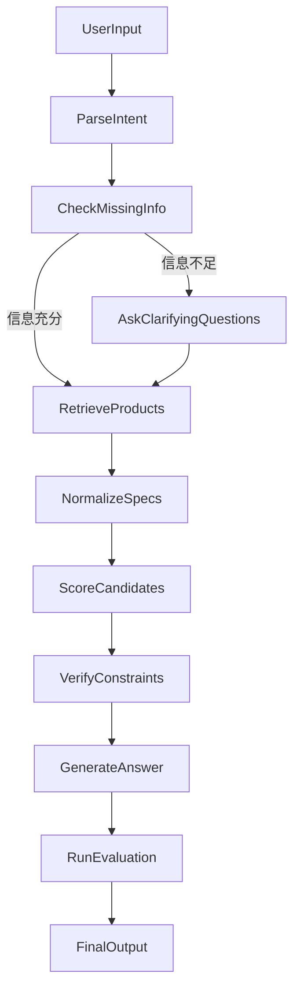

# 第一个 Agent 项目蓝图：智能购物决策 Agent

## 1. 项目定位

这个项目的目标不是做一个“什么都能聊”的泛化聊天机器人，而是做一个**约束条件驱动的智能购物决策 Agent**。它需要在用户给定预算、用途、偏好和限制条件后，主动澄清需求、检索候选商品、比较参数、识别不确定信息，并给出最终推荐。

对于暑期大模型 / Agent 工程师实习，这个方  向比“自动写小说”更有工程含金量，也比“一键经营整个网店”更适合作为第一个项目。

## 2. 为什么选择这个方向

### 2.1 对找实习更有帮助

- 能体现你会做 **LangGraph 工作流**，而不是只会调一个 LLM API。
- 能体现你理解 **RAG、工具调用、状态管理、评估闭环**。
- 推荐结果有相对明确的对错和优劣，更容易做测试集和 benchmark。
- 面试官更容易把它联想到真实业务，例如电商导购、选品助手、企业采购助手。

### 2.2 对你当前背景更友好

- 你已经了解 `LangChain`、`LangGraph`、`RAG`、`Transformer`，适合做多步推理流程。
- 你有 Python 基础，做 `FastAPI`、数据处理、LLM orchestration 会比较顺手。
- 你目前更需要的是一个**能快速完成、可展示、可讲清楚**的项目，而不是一个复杂但做不完的大系统。

## 3. V1 项目范围

### 3.1 推荐品类

第一版建议**明确收敛为单一品类深做**，不要一开始做真正的全品类。

原因：

- 不同品类的决策维度差异很大，很难共用一套稳定评分逻辑。
- 数据清洗和规格归一化成本会陡增。
- benchmark 难以统一设计，容易削弱项目可信度。
- 第一版更重要的是把工作流、评估和 Demo 做完整，而不是把品类铺得很大。

适合作为 `V1` 的候选品类如下：

- 首选：`笔记本电脑`
- 备选：`耳机`
- 备选：`显示器`

这里推荐你优先做 **笔记本电脑推荐 Agent**，并把它作为唯一的 `V1` 品类。

原因：

- 学生群体需求很真实，便于定义用户场景。
- 参数维度比较丰富，能体现结构化分析能力。
- 不同用户的约束冲突明显，适合展示 Agent 的澄清和取舍能力。

### 3.2 目标用户

建议把目标用户先定为这三类中的一类或两类：

- 大学生 / 研究生购机
- 轻度游戏玩家
- 程序员 / AI 初学者

### 3.3 输入信息

为了兼顾 `V1` 可控性和未来多品类扩展，建议从第一版开始就把输入 schema 分成两层：

#### `common_fields`

适用于未来大多数品类的通用字段：

- `budget_range`
- `usage_scenario`
- `brand_preference`
- `brand_avoid`
- `must_have`
- `must_not_have`
- `priority_weights`

#### `category_fields`

当前 `V1` 仅针对笔记本品类定义：

- `need_portability`
- `need_dedicated_gpu`
- `screen_size_preference`
- `battery_life_requirement`
- `new_or_used_preference`

也就是说，第一版虽然只做一个品类，但内部结构已经为以后扩到 `化妆品 / 电子产品 / 电器` 预留了统一接口。

### 3.4 V1 输出结果

系统输出建议固定为以下结构：

1. 对用户需求的理解摘要
2. 若信息不足，先提出 1 到 3 个澄清问题
3. 候选商品 Top-K 列表
4. 每个商品的关键参数和优缺点
5. 最终推荐结果
6. 为什么推荐它
7. 哪些信息是不确定的
8. 如果预算提高 / 降低，可替代什么方案

### 3.5 不建议在 V1 做的内容

以下内容先不要做，否则很容易失控：

- 自动下单
- 自动与商家议价
- 自动跨平台实时爬虫全网抓取
- 多平台登录态托管
- 完整多 Agent 社会化协作

## 4. 项目核心卖点

这个项目要重点展示四件事：

### 4.1 需求澄清能力

不是用户一输入“帮我推荐笔记本”，系统就直接胡乱推荐，而是先判断：

- 预算够不够清晰
- 使用场景够不够清晰
- 是否存在明显冲突条件

### 4.2 工具调用能力

Agent 不能只靠模型参数记忆，要会调用工具：

- 商品检索工具
- 商品详情解析工具
- 参数标准化工具
- 比较与评分工具
- 可选的网页搜索工具

### 4.3 结构化决策能力

不是生成一段“听起来很像推荐”的文字，而是：

- 先抽取参数
- 再统一结构
- 再按约束打分
- 最后生成结论

### 4.4 可评估能力

你要能证明这个 Agent 比“普通问答 + RAG”更好，而不是只展示一个漂亮 demo。

## 5. 推荐技术方案

### 5.1 技术栈

- 编程语言：`Python`
- Agent 编排：`LangGraph`
- 模型接入：`OpenAI API` / `DeepSeek API` / 兼容 OpenAI 的模型服务
- 检索与索引：`FAISS` 或 `Chroma`
- 后端：`FastAPI`
- 前端：
  - 简洁路线：`Streamlit`
  - 更工程化路线：`FastAPI + React`
- 追踪与观测：`LangSmith` 或自定义日志
- 数据处理：`pandas`、`pydantic`

### 5.2 数据来源建议

第一版不要直接做复杂爬虫，推荐以下两种方式：

#### 方案 A：人工整理商品数据

你先构造一个 `50 ~ 200` 条商品数据集，每条包含：

- 商品名
- 品牌
- 价格
- CPU
- GPU
- 内存
- 硬盘
- 重量
- 屏幕尺寸
- 电池续航
- 标签
- 商品描述
- 来源链接

优点：

- 进度可控
- 易于评估
- 方便后续做结构化比较

#### 方案 B：人工数据 + 少量实时搜索

先用本地商品库做主推荐，再用网页搜索补充：

- 当前价格
- 是否缺货
- 促销信息

这样比“从 0 做全网实时抓取”更合理。

## 6. LangGraph 工作流设计

建议你把整个系统拆成以下节点，而不是写成一个大函数。



### 6.1 节点说明

#### `ParseIntent`

作用：

- 把用户自然语言请求抽取成结构化约束
- 输出 `budget`、`scenario`、`brand_preference`、`must_have` 等字段

#### `CheckMissingInfo`

作用：

- 判断是否缺失关键决策字段
- 如果缺失，转到澄清节点

示例：

- “预算多少？”
- “你更看重便携还是性能？”
- “是否接受游戏本重量？”

#### `RetrieveProducts`

作用：

- 根据预算、用途、偏好从商品库或向量库中筛选候选商品

#### `NormalizeSpecs`

作用：

- 把商品参数归一化，避免不同来源格式不一致

例如：

- `16GB` 与 `16g`
- `RTX4060` 与 `4060 Laptop GPU`

#### `ScoreCandidates`

作用：

- 按规则和模型结合的方式进行打分

建议采用“规则打分 + LLM 总结”的组合，不要完全依赖模型主观判断。

#### `VerifyConstraints`

作用：

- 对最终候选做硬约束校验

例如：

- 超预算则淘汰
- 用户明确不要某品牌则淘汰
- 用户要求轻薄但重量过高则降权

#### `GenerateAnswer`

作用：

- 生成面向用户的最终推荐说明
- 说明推荐理由、取舍逻辑和不确定点

#### `RunEvaluation`

作用：

- 对当前结果做自动评估或离线记录

## 7. 推荐的评分机制

你可以把评分拆成硬约束和软约束两层。

### 7.1 硬约束

硬约束不满足则直接淘汰，例如：

- 价格超过预算上限
- 没有独显但用户明确要求独显
- 重量超过用户明确上限

### 7.2 软约束

软约束用于排序，例如：

- 便携性
- 性能
- 续航
- 品牌偏好
- 性价比

可以设计一个简单可解释的公式：

```text
total_score =
0.30 * performance_score +
0.25 * portability_score +
0.20 * battery_score +
0.15 * price_value_score +
0.10 * brand_preference_score
```

后续让用户画像决定权重，是第二阶段再做的内容。

## 8. RAG 应该怎么放进去

这个项目适合做 **Agentic RAG**，而不是把 RAG 当作“检索几段文本然后拼到 prompt 里”。

### 8.1 可以检索什么

- 商品参数文档
- 商品评测摘要
- 用户评价摘要
- 品牌特征知识
- 选购指南

### 8.2 Agentic RAG 的体现方式

- 当用户表达含糊时，先澄清，而不是直接检索
- 当结果置信度不高时，触发补检索
- 当候选商品信息不一致时，触发校验步骤
- 当知识库没有答案时，显式告诉用户不确定，而不是编造

## 9. 评估闭环怎么做

这是项目能不能打动面试官的关键。

### 9.1 评估集设计

你至少准备 `20 ~ 30` 条测试样例，每条包括：

- 用户问题
- 用户真实约束
- 期望输出特征
- 可接受候选集合
- 禁止推荐项

示例：

```text
问题：6000 元以内，主要写代码和轻度打游戏，最好轻一点，不要联想。
期望：推荐预算内、适合编程、轻度游戏、非联想品牌的机型。
禁止：超预算、无独显但强行推荐高游戏需求机型、联想品牌。
```

### 9.2 指标建议

- `constraint_satisfaction_rate`：约束满足率
- `top1_accept_rate`：第一推荐可接受率
- `hallucination_rate`：幻觉率
- `clarification_success_rate`：澄清有效率
- `fallback_rate`：失败回退率

### 9.3 对比实验

至少做两组对比：

1. 普通 LLM 问答
2. RAG + LangGraph Agent

如果时间允许，再加：

3. 规则系统 + LLM 总结

## 10. 推荐目录结构

建议你的项目目录像这样：

```text
shopping-agent/
├── app/
│   ├── api/
│   │   └── routes.py
│   ├── adapters/
│   │   └── laptop_adapter.py
│   ├── graph/
│   │   ├── state.py
│   │   ├── nodes.py
│   │   └── edges.py
│   ├── tools/
│   │   ├── retrieve_products.py
│   │   ├── normalize_specs.py
│   │   ├── scoring.py
│   │   └── web_search.py
│   ├── rag/
│   │   ├── vector_store.py
│   │   ├── retriever.py
│   │   └── documents/
│   ├── schemas/
│   │   ├── common_fields.py
│   │   ├── category_fields.py
│   │   ├── user_query.py
│   │   └── product.py
│   ├── services/
│   │   └── recommendation_service.py
│   └── main.py
├── data/
│   ├── raw/
│   ├── processed/
│   └── benchmark/
├── notebooks/
├── tests/
│   ├── test_nodes.py
│   ├── test_tools.py
│   └── test_eval.py
├── frontend/
├── README.md
├── requirements.txt
└── .env.example
```

其中建议重点预留两层抽象：

- `common_fields`：预算、品牌偏好、用途、禁忌等跨品类字段
- `category_fields`：品类特有字段，`V1` 先只实现 `laptop_adapter`

这样你后续如果要扩到 `化妆品 / 电子产品 / 电器`，不需要推翻原有状态机和工具接口。

## 11. Demo 应该长什么样

你的 demo 不要只展示一个聊天框，建议至少展示三个区域：

### 11.1 输入区

- 用户需求文本
- 结构化筛选项
- 示例问题按钮

### 11.2 结果区

- 最终推荐
- 候选商品 Top-3
- 参数对比表
- 推荐理由
- 不确定信息提醒

### 11.3 Agent 过程区

- 当前识别到的预算和需求
- 是否触发了澄清
- 调用了哪些工具
- 最终评分结果

这会明显提升项目的“工程感”。

## 12. README 应该包含什么

你项目的 `README` 建议有以下结构：

1. 项目简介
2. 为什么要做这个项目
3. 系统架构图
4. 核心工作流
5. 数据来源说明
6. 评估方法与 benchmark
7. 快速启动方式
8. Demo 截图
9. 已知问题与后续迭代

## 13. 简历上怎么写

下面是比较适合放在简历里的表达方式。

### 13.1 项目标题

`智能购物决策 Agent（LangGraph / RAG / Tool Calling）`

### 13.2 简历描述示例

- 基于 `LangGraph` 设计多阶段购物决策 Agent，支持需求澄清、候选检索、参数归一化、约束校验与推荐生成。
- 构建商品知识库与结构化评分模块，将 `RAG`、规则系统与 `LLM` 推理结合，提升复杂约束场景下的推荐可解释性。
- 设计离线 benchmark，围绕约束满足率、Top-1 可接受率、幻觉率等指标评估 Agent 效果，并与普通问答式方案进行对比。
- 通过 `FastAPI + Web UI` 完成端到端演示，支持可视化查看 Agent 节点流转、工具调用与推荐结果。

### 13.3 面试时要主动强调

- 为什么不用单轮问答，而要用 LangGraph
- 为什么要把评分逻辑部分规则化
- 如何定义“推荐正确”
- 如果数据不完整，系统如何回退
- 如何降低幻觉和错误推荐风险

## 14. 四周落地路线

### 第 1 周：定题与数据

- 确定只做“笔记本推荐”
- 确定目标用户画像
- 准备 50 到 200 条商品数据
- 设计 `common_fields + category_fields` 结构化 schema

### 第 2 周：核心链路

- 完成意图解析
- 完成缺失信息检测
- 完成商品检索
- 完成参数归一化
- 完成评分与排序
- 预留 `category_adapter` 接口，但只实现笔记本品类

### 第 3 周：Agent 化与评估

- 用 `LangGraph` 串联节点
- 接入 RAG
- 增加失败回退逻辑
- 构造 benchmark
- 跑基础评估
- benchmark 先只覆盖单品类，避免评估标准混乱

### 第 4 周：展示与包装

- 做 Web Demo
- 增加 trace 展示
- 写 README
- 准备项目讲解稿
- 提炼简历表述
- 在 README 中明确说明多品类扩展是 `V2` 目标

## 15. 后续升级方向

当你完成第一个版本后，可以继续往两个方向升级。

### 15.0 升级到有限多品类

如果你后续真的想覆盖 `化妆品 / 电子产品 / 电器` 三大类，建议不要直接做“全品类”，而是每个大类先选 1 个代表性子品类：

- 化妆品：`粉底液` 或 `防晒`
- 电子产品：`耳机` 或 `平板`
- 电器：`扫地机器人` 或 `空气炸锅`

此时项目形态应当是“统一 Agent 框架 + 品类适配器”，而不是无限商品池的全站推荐系统。

### 15.1 升级成商家侧选品 Agent

功能包括：

- 竞品分析
- 价格带分析
- 卖点提炼
- 用户评论总结

### 15.2 升级成店铺运营 Copilot

但要注意先做“单一高价值环节”，例如：

- 仅做选品分析
- 仅做客服问答
- 仅做商品上架文案生成

不要一开始就做“自动选品 + 谈判 + 上架 + 发货 + 售后”的全自动系统。

## 16. 最终建议

如果你的目标是暑期找到更偏大模型应用 / Agent 工程的实习，那么第一个项目最优解不是“炫技式多 Agent”，而是：

**一个边界清晰、结果可验证、工作流完整、能讲清楚取舍逻辑的垂直 Agent 项目。**

对你来说，最值得开做的版本就是：

**面向学生购机场景的笔记本智能推荐 Agent。**
